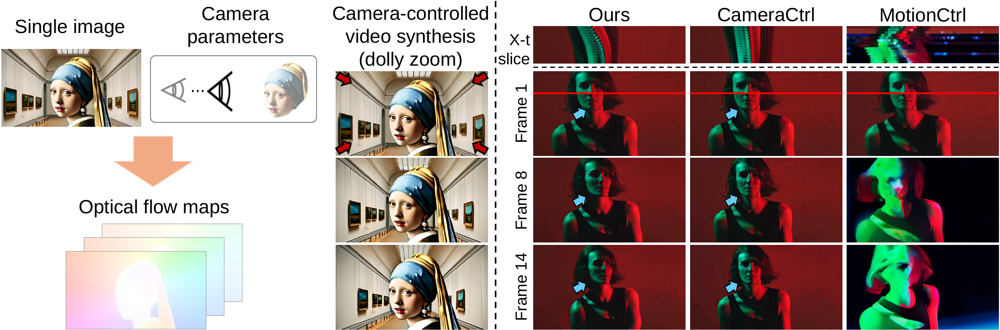

# FloVD: Optical Flow Meets Video Diffusion Model for Enhanced Camera-Controlled Video Synthesis (CogVideoX-based FloVD)<br>



[\[Project Page\]](https://jinwonjoon.github.io/flovd_site/)
[\[arXiv\]](https://arxiv.org/abs/2502.08244/)

**FloVD: Optical Flow Meets Video Diffusion Model for Enhanced Camera-Controlled Video Synthesis**<br>
Wonjoon Jin, Qi Dai, Chong Luo, Seung-Hwan Baek, Sunghyun Cho<br>
POSTECH, Microsoft Research Asia
<br>

## Gallery

### FloVD-CogVideoX-5B


<table border="0" style="width: 100%; text-align: left; margin-top: 20px;">
  <tr>
      <td>
          <video src="https://github.com/user-attachments/assets/a55d1c29-6682-417d-886c-695b1d1b61fd" width="100%" controls autoplay loop></video>
      </td>
      <td>
          <video src="https://github.com/user-attachments/assets/4def8617-063f-4e61-969a-fd0507dbdeec" width="100%" controls autoplay loop></video>
      </td>
       <td>
          <video src="https://github.com/user-attachments/assets/55745611-fea3-4f3f-bdd1-48b5f6c24f98" width="100%" controls autoplay loop></video>
     </td>
      <td>
          <video src="https://github.com/user-attachments/assets/97be3121-ae38-45f9-822a-e387cf262824" width="100%" controls autoplay loop></video>
     </td>
  </tr>
</table>

## Project Updates

- **News**: ```2025/05/02```: We have updated the code for `FloVD-CogVideoX`. We will release dataset preprocessing and training codes soon.

- **News**: ```2025/02/26```: Our paper has been accepted to CVPR 2025.


## Quick Start

### Prompt Optimization

As mentioned in [CogVideoX](https://github.com/THUDM/CogVideo), we recommend to use long, detailed text prompts to get better results. Our FloVD-CogVideoX model is trained using text captions extracted from [CogVLM2](https://github.com/THUDM/CogVLM2).

### Environment

**Please make sure your Python version is between 3.10 and 3.12, inclusive of both 3.10 and 3.12.**

```
pip install -r requirements.txt
```

### Optical flow normalization
As mentioned in FloVD paper, we normalize optical flow following [Generative Image Dynamics](https://generative-dynamics.github.io/). For this, we use scale factors (s_x, s_y) of (60, 36) for both FVSM and OMSM.

### Pre-trained checkpoints
Download the FloVD-CogVideoX <br>
FVSM and OMSM (Curated) <br>
[\[Google Drive\]](https://drive.google.com/drive/folders/1Y7Fha8QKX6bg_0YEOxQf0M6uaPJ9SfgB?usp=sharing)
In addition, we used the off-the-shelf depth estimation model (Depth Anything V2, metric depth).
For these models, please refer links below. <br>
[\[Depth_anything_v2_metric\]](https://github.com/DepthAnything/Depth-Anything-V2/tree/main/metric_depth)
<br>
Then, place these checkpoints in ./ckpt directory
```shell
# File tree
./ckpt/
├── FVSM
│   ├ FloVD_FVSM_Controlnet.pt
├── OMSM
│   ├ selected_blocks.safetensors
│   ├ pytorch_lora_weights.safetensors
├── others
│   ├ depth_anything_v2_metric_hypersim_vitb.pth
```

### Pre-defined camera trajectory
We provide several example camera trajectory for user's quick inference.
Refer to "./assets/cam_trajectory/" for visualization of each camera trajectory.
```shell
# File tree
./assets/
├── manual_poses
│   ├ ...
├── re10k_poses
│   ├ ...
├── manual_poses_PanTiltSpin
│   ├ ...
```

### Inference

+ [flovd_demo](inference/flovd_demo.py): To synthesize videos with desired camera trajectory and natural object motions, use this. A more detailed inference code explanation, including the significance of common parameters. Refer to [flovd_demo_script](inference/inference_scripts/flovd_demo.sh)

+ [flovd_fvsm_demo](inference/flovd_fvsm_demo.py): You can solely use FVSM model for more accurate camera control with little object motions. This code omits OMSM and only uses FVSM. (The script will be released soon.)

+ [flovd_ddp_demo](inference/flovd_ddp_demo.py): If you want to sample large number of videos, you can use this. Note that you need to prepare dataset in advance following our dataset preprocessing pipeline. (The preprocessing pipeline will be released.)

### Tools

This folder contains some tools for camera trajectory generation, visualization, etc.

+ [generate_camparam](tools/generate_camparam.py): Generate manual camera parameters such as zoom-in, zoom-out, etc.

+ [visualize trajectory](tools/visualize_trajectory.py): Converts SAT model weights to Huggingface model weights.


## Citation

🌟 If you find our work helpful, please leave us a star and cite our paper.

```
@article{jin2025flovd,
  title={FloVD: Optical Flow Meets Video Diffusion Model for Enhanced Camera-Controlled Video Synthesis},
  author={Jin, Wonjoon and Dai, Qi and Luo, Chong and Baek, Seung-Hwan and Cho, Sunghyun},
  journal={arXiv preprint arXiv:2502.08244},
  year={2025}
}
```

## Reference
We thank [CogVideoX](https://github.com/THUDM/CogVideo) for open source

## Model-License

The CogVideoX-5B model (Transformers module, include I2V and T2V) is released under
the [CogVideoX LICENSE](https://huggingface.co/THUDM/CogVideoX-5b/blob/main/LICENSE).
